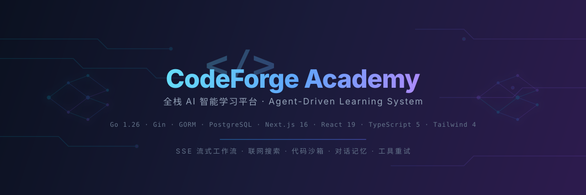

<p align="center">
  
</p>

<p align="center">
  <strong>面向开发者的 AI 智能学习平台</strong><br/>
  SSE 流式工作流 · 联网搜索 · 代码沙箱 · 对话记忆 · 工具重试
</p>

<p align="center">
  
  
  
  
  
  
  
  
</p>

<p align="center">
  <a href="#快速开始">🚀 快速开始</a> ·
  <a href="#ai-agent-架构">🤖 Agent 架构</a> ·
  <a href="#项目结构">📁 项目结构</a> ·
  <a href="#技术栈">⚡ 技术栈</a> ·
  <a href="#验证">✅ 验证</a>
</p>

---

## 核心能力

<table>
<tr>
<td width="50%">

### AI Agent 对话

- **SSE 流式输出** — token 逐字推送，零延迟感知
- **智能路由** — 根据问题、页面、附件和会话记忆自动分发到 6 类 Agent
- **动态工具规划** — 关键词匹配 + LLM 判断双重机制，15 个内置工具
- **对话记忆** — 持久化到数据库，重启/刷新后完整恢复
- **历史会话** — 新对话 / 切换 / 删除，侧栏实时刷新
- **工作流可视化** — 每条消息内联展示工具调度全流程
- **工具重试** — 最多 5 次重试，间隔递增，失败降级到本地知识
- **系统提示词热加载** — 编辑 `backend/prompts/system_prompt.md` 即时生效
- **时间感知** — 每次请求自动注入当前时间

</td>
<td width="50%">

### 联网搜索

- **SearXNG 本地搜索** — 无需 API Key，Docker 一键启动
- **关键词自动提取** — 去掉对话前缀，限制长度，避免超时
- **AI 意图判断** — 关键词未命中时，LLM 判断是否需要搜索
- **多级回退** — SearXNG → DuckDuckGo → Wikipedia

### 学习系统

- 五大方向课程流（Python / C++ / 数据库 / 算法 / Agent）
- 每日一题 · 代码模板 · 在线运行 · 提交评分
- 学习进度 · 时长统计 · 连续打卡 · 活动流 · 成就
- 用户画像 · 知识图谱 · 学习路径
- 简历分析 · 项目实战 · 笔试模拟
- **简历优化** — 支持上传自己的 DOCX 模板,AI 优化内容后按模板样式导出(docx/pdf)
- 代码沙箱（Python / JS / C++ / Rust）

</td>
</tr>
</table>

## AI Agent 架构

```
用户提问
   │
   ▼
┌──────────────────┐
│   智能路由         │  关键词 + 对话记忆 → 6 类 Agent
└──────┬───────────┘
       ▼
┌──────────────────┐
│   工具规划         │  关键词匹配 + LLM 判断
│   (planAgentTools)│  → 联网搜索 / 文档阅读 / 代码执行 / ...
└──────┬───────────┘
       ▼
┌──────────────────┐
│   工具执行         │  最多 5 次重试，间隔递增（1s→2s→3s→4s→5s）
│ (executeWithRetry)│  失败后注入上下文，模型用本地知识回答
└──────┬───────────┘
       ▼
┌──────────────────┐
│   上下文构建       │  对话记忆(12条) + 工具结果 + 当前时间
└──────┬───────────┘
       ▼
┌──────────────────┐
│   LLM 流式回答     │  SSE token 实时推送 → 前端逐字渲染
└──────┬───────────┘
       ▼
┌──────────────────┐
│   持久化           │  用户消息 + 助手回答 + 工作流 JSON → 数据库
└──────────────────┘
```

<details>
<summary><b>内置工具清单（15 个）</b></summary>

| 工具 | 分类 | 功能 |
|------|------|------|
| `web_search` | 信息获取 | SearXNG 联网搜索，Wikipedia 回退 |
| `doc_reader` | 信息获取 | 图片/文本/代码附件解析 |
| `code_search` | 开发工具 | 附件或工作区中查找定义与引用 |
| `git_helper` | 开发工具 | 读取工作区状态，生成提交说明 |
| `code_execute` | 开发工具 | 受限沙箱中运行代码 |
| `self_heal` | 开发工具 | 分析错误并提出最小修复 |
| `sql_explain` | 开发工具 | SQL 静态分析 + 索引优化建议 |
| `diagram_gen` | 内容生成 | Mermaid 架构图和流程图 |
| `mindmap_gen` | 内容生成 | Mermaid 思维导图 |
| `quiz_gen` | 学习工具 | 按知识点生成练习题 |
| `leetcode_fetch` | 学习工具 | 站内题库检索 |
| `course_search` | 学习工具 | 站内课程和章节检索 |
| `progress_query` | 学习工具 | 读取学习进度并生成建议 |
| `resume_review` | 职业工具 | 简历结构与表达分析 |
| `project_review` | 职业工具 | 项目源码和完成度分析 |

</details>

<details>
<summary><b>对话记忆机制</b></summary>

- **唯一真相来源**：每轮对话的 `SessionMessage` 持久化到 PostgreSQL，不另建内存缓存
- **工作记忆**：`loadConversationMemory` 从数据库读取最近 12 条
- **指代解析**：`buildConversationPrompt` 把记忆拼入提示，解析"这个/它/上面"等指代
- **工具上下文**：`contextualToolMessage` 在追问时把最近 4 轮记忆注入工具调用
- **完整恢复**：重启或浏览器刷新后从持久化数据恢复全部上下文
- **会话隔离**：每个 `session_id` 独立，切换会话不影响其他会话

</details>

<details>
<summary><b>系统提示词热加载</b></summary>

系统提示词从 `backend/prompts/system_prompt.md` 文件读取：

- 带文件缓存 + 修改时间检测，**编辑文件后自动热加载，无需重启**
- 每次请求自动注入当前时间（Asia/Shanghai）
- 修改提示词只需编辑文件，无需重新部署

</details>

## 技术栈

<table>
<tr>
<td width="33%" valign="top">

### 后端

| 技术 | 版本 |
|------|------|
| Go | 1.26 |
| Gin | 1.10 |
| GORM | 1.25 |
| JWT | v5 |
| MinIO Go | v7 |

</td>
<td width="33%" valign="top">

### 前端

| 技术 | 版本 |
|------|------|
| Next.js | 16 |
| React | 19 |
| TypeScript | 5 |
| Tailwind CSS | 4 |
| shadcn/ui | latest |
| pnpm | 9 |

</td>
<td width="33%" valign="top">

### 基础设施

| 服务 | 端口 |
|------|------|
| PostgreSQL + pgvector | 5432 |
| Redis 7.4 | 6379 |
| SearXNG | 8081 |
| MinIO | 9000 / 9001 |
| Gotenberg（docx→PDF） | 3000 |

</td>
</tr>
</table>

## 快速开始

### 环境要求

> Go ≥ 1.26 · Node.js ≥ 20 + pnpm 9 · Docker Desktop · PowerShell

### 克隆

```bash
git clone https://github.com/NoraStory/AgenticLearningSystem.git
cd AgenticLearningSystem
```

### 配置

```powershell
Copy-Item .env.example .env
```

编辑 `.env`，按需填写 Ark 模型配置。留空时 Agent 使用本地降级回退，系统仍可运行：

```env
# 可选：Ark 模型（留空时使用本地降级）
ARK_API_KEY=
ARK_MODEL=doubao-seed-2-1-pro-260628
ARK_BASE_URL=https://ark.cn-beijing.volces.com/api/v3
LLM_WIRE_API=responses

# 联网搜索
SEARCH_PROVIDER=searxng
SEARCH_BASE_URL=http://localhost:8081
SEARCH_TIMEOUT_SECONDS=15
```

### 启动

```powershell
.\scripts\setup.ps1                        # 首次初始化依赖
.\scripts\start.ps1                         # 启动基础设施 + 前后端
```

### 访问

| 入口 | 地址 |
|------|------|
| 🖥 前端 | http://localhost:5000 |
| 🔌 后端 API | http://localhost:8080/health |
| 📦 MinIO 控制台 | http://localhost:9001 |

<details>
<summary><b>默认账号 & 状态管理</b></summary>

**默认账号**：`demo@codeforge.local` / `Demo123!`

```powershell
.\scripts\setup.ps1 -SkipFrontendInstall   # 跳过前端依赖安装
.\scripts\status.ps1                         # 查看运行状态
.\scripts\stop.ps1                           # 停止前后端
.\scripts\stop.ps1 -Infrastructure           # 同时停止 Docker
```

</details>

## 项目结构

```
AgenticLearningSystem/
├── backend/                        # 🦫 Go 后端
│   ├── cmd/server/main.go          #    入口
│   ├── internal/
│   │   ├── api/                    #    路由 + 处理器
│   │   │   ├── agent.go            #      Agent SSE 工作流
│   │   │   ├── agent_memory.go     #      对话记忆 + 上下文
│   │   │   ├── agent_sessions.go   #      会话列表 + 删除
│   │   │   ├── tool_planner.go     #      工具规划 + 执行器
│   │   │   ├── tool_helpers.go     #      重试 + 关键词 + 提示词
│   │   │   └── server.go           #      路由 + 中间件
│   │   ├── config/                 #    配置加载
│   │   ├── database/               #    连接 + 迁移 + 种子
│   │   ├── llm/client.go           #    LLM SSE 流式客户端
│   │   ├── model/models.go         #    GORM 模型（32 表）
│   │   ├── sandbox/runner.go       #    代码沙箱
│   │   └── storage/store.go        #    MinIO 存储
│   ├── prompts/
│   │   └── system_prompt.md        #    可编辑提示词（热加载）
│   └── migrations/                 #    SQL 迁移
│
├── frontend/                       # ⚛️ Next.js 前端
│   ├── src/app/                    #    App Router 页面
│   │   ├── agent/chat/             #      AI 对话 + 工作流
│   │   ├── agent/profile/          #      用户画像 + 知识图谱
│   │   ├── agent/tools/            #      工具管理
│   │   ├── python/ cpp/ database/
│   │   │   algorithm/              #      五大学习方向
│   │   ├── course/ practice/
│   │   │   learning-path/          #      课程/练习/路径
│   │   ├── interview/ project/
│   │   │   resume/                 #      笔试/项目/简历
│   │   └── profile/                #      个人中心
│   ├── documents/                  #    设计文档
│   └── lib/api.ts                  #    API 客户端
│
├── scripts/                        # 🔧 PowerShell 脚本
├── searxng/settings.yml            # 🔍 SearXNG 配置
├── tests/fixtures/                 # 🧪 测试夹具
├── docs/banner.svg                 # 🎨 README Banner
├── docker-compose.yml              # 🐳 基础设施编排（PostgreSQL/Redis/SearXNG/MinIO/Gotenberg）
├── .env.example                    # 📋 环境变量模板
├── AGENTS.md                       # 🤖 AI 编码约定
└── README.md                       # 📖 你在这里
```

## 验证

```powershell
# 后端
cd backend
$env:GOMODCACHE="$PWD\.gomodcache"; $env:GOCACHE="$PWD\.gocache"; $env:GOPATH="$PWD\.gopath"
go test ./...                          # 单元测试

# 前端
cd ..\frontend
$env:COREPACK_HOME="$PWD\.corepack"
corepack pnpm ts-check                 # TypeScript 类型检查
corepack pnpm lint                     # ESLint + Stylelint
corepack pnpm exec next build          # 生产构建
```

## 依赖环境约定

> **所有包均使用项目内缓存目录，绝不写入全局。**

| 运行时 | 缓存目录 | 说明 |
|--------|----------|------|
| Python | `backend/.venv/` | `python -m venv`；docx 模板渲染依赖 `python-docx` + `docxtpl`(见 `backend/scripts/requirements.txt`) |
| Go | `backend/.gomodcache/` `.gocache/` `.gopath/` | 环境变量指定 |
| 前端 | `frontend/.corepack/` `.pnpm-store/` | corepack 管理 |

均已在 `.gitignore` 中排除。

## 设计文档

| 文档 | 路径 |
|------|------|
| 后端 API 接口 | [`frontend/documents/API_SPEC.md`](frontend/documents/API_SPEC.md) |
| 数据库设计 | [`frontend/documents/DATABASE_DESIGN.md`](frontend/documents/DATABASE_DESIGN.md) |
| AI Agent 设计 | [`frontend/documents/AGENT_DESIGN.md`](frontend/documents/AGENT_DESIGN.md) |
| AI 编码约定 | [`AGENTS.md`](AGENTS.md) |

---

<p align="center">
  <sub>Built with ❤️ by <a href="https://github.com/NoraStory">NoraStory</a></sub><br/>
  <sub>本项目仅用于学习和个人使用</sub>
</p>
